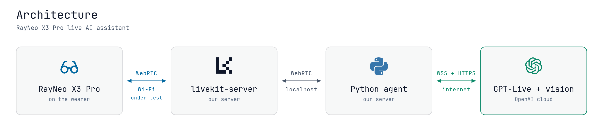

# RayNeo X3 Pro live AI assistant

A live voice-and-vision assistant for RayNeo X3 Pro AR glasses, built on LiveKit and the
Gemini Live API.

## Architecture

<picture>
  <source media="(prefers-color-scheme: dark)" srcset="docs/architecture-dark.png">
  
</picture>

<sub>Hand-laid-out SVG, no diagram engine — sources are
[`docs/architecture-dark.svg`](docs/architecture-dark.svg) and
[`-light.svg`](docs/architecture-light.svg), both transparent.
`python docs/make_diagram.py` regenerates them and re-renders the PNGs.</sub>

Both halves live in this repo and meet at exactly one place: **a LiveKit room**. The
glasses publish microphone and camera tracks into it; the agent joins the same room,
forwards that audio and video to Gemini Live, and publishes Gemini's speech back as its
own audio track. The glasses never talk to Gemini directly — they hold no Google
credentials and know nothing about which model is in use.

That seam is why the phases are ordered the way they are. A browser publishes tracks the
same way the glasses will, so once phase 1 passes, the server is known-good and any later
failure is on the client side by elimination.

### Transports

The `WebRTC` labels above are shorthand. Each link to the server is really more than one
connection:

| Connection | Transport | Purpose |
| --- | --- | --- |
| Worker registration | WebSocket, `:7880` | The agent announces itself and receives job assignments. Agent only — the glasses have no equivalent. |
| Room signaling | WebSocket, `:7880` | SDP/ICE negotiation, participant and track events |
| Media | SRTP over UDP `:7882`, TCP `:7881` as fallback | The audio and video packets themselves |

Only the last one is WebRTC media, and it's what buys us jitter buffering, packet loss
concealment, and congestion control over flaky Wi-Fi. Streaming raw PCM over a WebSocket
would mean reimplementing all of that, and TCP head-of-line blocking turns one lost packet
into an audible stall.

The agent is an ordinary room participant, not a privileged backend service — the SFU
treats the Python worker exactly as it treats a browser tab or the glasses. The Python
`livekit` package ships `livekit_ffi.dll`, Rust bindings around libwebrtc, the same engine
Chrome uses.

On the far side the transport flips: agent → Gemini is a WebSocket, with audio and video
frames muxed into one message stream. So part of the agent's job is translating between the
two worlds, depacketizing WebRTC audio for Gemini and packetizing Gemini's speech back into
an outbound WebRTC track.

### Layout

```
backend/
  docker-compose.yml    api + agent. livekit-server runs on the host, outside compose
  .env.example          copy to .env and fill in; one file for both services
  api/                  the one HTTP service the glasses call
    src/server.py       POST /getToken: LiveKit's standard token endpoint
    src/auth.py         who is asking -- AUTH_MODE = dev | static | jwt
  agent/                the LiveKit agent, dispatched into rooms by name
    src/agent.py        entrypoint, server, session start
    src/config.py       env + session model factory
    src/prompts.py      system instructions
    src/tools.py        @function_tool defs
android/                Kotlin + Compose app for the glasses
  app/src/main/.../TokenExt.kt    where the backend is, and what credential to show it
  app/src/main/.../ui/Eyes.kt     draws the UI once per eye
deploy/                 livekit-server configs: lab LAN, and a home server behind
                        Caddy on 80/443 (see "Deploying somewhere real")
```

Three processes at runtime, and the split is the product's shape, not an accident:

- **livekit-server** verifies join tokens and forwards media. It never issues tokens and
  never knows who a user is. It runs on the host rather than in compose because WebRTC
  needs its UDP ports reachable at the address it advertises, and every Docker networking
  mode gets that wrong somewhere, Docker Desktop on Windows most of all.
- **api** is the door. The glasses `POST /getToken` with a credential; `auth.py` turns that
  into a user id or a 401; `server.py` signs a ten-minute LiveKit JWT whose identity is that
  user id and whose `room_config` names the agent. This is where a real product's login,
  entitlements and billing would go. Everything behind it only ever sees the user id.
- **agent** registers under `AGENT_NAME` and waits. Explicit dispatch means it joins exactly
  the rooms the api created and nothing else. Nothing connects to it; it is reachable only
  through the room, and it alone holds the Gemini key.

`AUTH_MODE` is what makes the same code usable on a private LAN and in production.
`dev` accepts everyone and logs a warning at startup; `static` wants one shared bearer
token; `jwt` verifies a token from an account system we do not have yet and takes the
user id from its `sub`. It is a documented switch in `.env`, not a back door: the
production path is the only path, and `dev` just answers the "who is this" question with
"whoever". See `backend/api/src/auth.py`.

`config.py` holds the only real abstraction: `build_session_model()` returns keyword
arguments for `AgentSession`. Today that's a single realtime speech-to-speech model.
Swapping in a half-cascade setup later means returning `{"llm": ..., "tts": ...}` from
that one function; `agent.py` doesn't change.

The model string is never hardcoded — it's read from `GEMINI_MODEL` so we can A/B models
by editing `backend/.env`.

## Phase 1 — the agent

### 1. Run livekit-server locally

Dev mode uses the well-known key pair `devkey` / `secret` and binds to `127.0.0.1:7880`.

Download `livekit_<version>_windows_amd64.zip` from
[the releases page](https://github.com/livekit/livekit/releases/latest), unzip
`livekit-server.exe` somewhere on your PATH, then:

```shell
livekit-server --dev
```

On Windows it logs `CPU monitoring unsupported` and disables capacity management. That's
expected and harmless for local development.

Docker works too, if you'd rather:

```shell
docker run --rm -it -p 7880:7880 -p 7881:7881 -p 7882:7882/udp livekit/livekit-server --dev
```

### 2. Configure the agent

```shell
cd backend
cp .env.example .env
# then put your Gemini API key in GOOGLE_API_KEY, and for `uv run` outside compose set
# LIVEKIT_URL=ws://127.0.0.1:7880
```

Get a key at [aistudio.google.com/apikey](https://aistudio.google.com/apikey). The plugin
reads it via `GOOGLE_API_KEY`; it never touches LiveKit Cloud.

### 3. Install and run

```shell
cd backend/agent
uv sync
uv run src/agent.py console   # talk to the agent in your terminal
```

`console` mode runs a full session locally and does **not** connect to livekit-server —
useful for checking the model, prompt, and tool calling in isolation. To exercise the
actual room transport instead:

```shell
uv run src/agent.py dev       # registers with livekit-server, waits for a room
```

Ask it to remember something ("remember that I parked in section B") to see the
placeholder `remember_note` tool fire in the logs.

Usage comes out of those logs too — `agent.py` subscribes to `session_usage_updated` and
logs each `ModelUsage` with `input_image_tokens` spelled out separately, because
`_BaseModelUsage.__repr__` omits zero-valued fields and zero image tokens is precisely the
interesting case. (`metrics_collected` is deprecated in 1.6.10 and warns; this is the
current event.) The counts are cumulative per session, so the last line of a call is its
total.

Two notes on `dev` with the pinned SDK (1.6.10): it prints a deprecation warning pointing
at `lk agent dev`, which is LiveKit Cloud-oriented and not what we want, and its
in-process auto-reload has been removed, so restart it by hand after edits. `dev` still
works fine against a self-hosted server. For a long-running worker use `start`, and for
debugging one specific room use `connect --room <name>`.

### Two traps on Windows

**Console mode can die on a `UnicodeEncodeError`.** The TUI prints emoji, and if stdout
lands on a `cp1252` codepage it crashes in `rich`'s legacy Windows renderer. Force UTF-8
once per shell session:

```powershell
$env:PYTHONUTF8 = "1"     # PowerShell
uv run src/agent.py console
```

```shell
export PYTHONUTF8=1       # bash / git-bash
uv run src/agent.py console
```

**Don't set the root logger to `DEBUG`.** Doing so enables the `websockets` client logger,
which dumps outgoing headers — including the `x-goog-api-key` header, in plaintext, with
your Gemini key in it. The `--log-level debug` flag on `dev`/`start` is scoped to LiveKit's
own loggers and does *not* leak the key; a blanket `logging.basicConfig(level=DEBUG)` in
your own script does. If you ever do it by accident, rotate the key.

Metrics and usage come from the agent's own log output; there's no separate
instrumentation.

## Notes on the model

We target `gemini-3.1-flash-live-preview`, which has
[documented compatibility gaps](https://docs.livekit.io/agents/models/realtime/plugins/gemini/#gemini-3-1-compatibility)
with LiveKit Agents. Two shape the code:

- **No opening greeting.** The model rejects `send_client_content` after the first model
  turn, so `session.generate_reply()` is ignored with a warning. The wearer speaks first.
  This is why `agent.py` has no greeting call where the quickstart has one.
- **No mid-session instruction or context updates.** `update_instructions()` and
  `update_chat_ctx()` don't take effect, which also rules out agent handoffs. We run a
  single agent, so this costs us nothing today.

- **The test framework can't test 3.1.** `session.run(user_input=...)` is built on
  `generate_reply()`, so it raises `RealtimeError: generate_reply is not compatible with
  'gemini-3.1-flash-live-preview'`. Behavioral tests via `pytest` are therefore off the
  table while 3.1 is the target model — verification has to go through a real audio
  conversation. The same tests pass against a 2.5 model, so they're useful for checking
  prompt and tool wiring, just not the model we ship.

Also: affective dialog and proactive audio are unsupported on 3.1 and are not set, tool
calls are synchronous (the model waits for the result), and `thinking_config` uses
`thinkingLevel` rather than `thinkingBudget`, defaulting to `minimal` for latency.

None of this affects live audio. Real speech turns arrive over the realtime audio path,
not `send_client_content`, and the docs confirm voice conversations, tool calling, and
audio I/O all work normally on 3.1.

Tool calling does work on 3.1, warning notwithstanding: `remember_note` fired end to end
(`remember_note fired: Parked on level B2, red section.`) from a spoken request.

Video input is enabled via `RoomOptions(video_input=True)`. Frames stream inline within
the Gemini realtime protocol, sampled at 1 fps while the wearer speaks and 0.3 fps
otherwise. What each frame costs is measured below.

## Phase 2 — Android client

`android/` is Kotlin + Jetpack Compose, derived from
[`agent-starter-android`](https://github.com/livekit-examples/agent-starter-android)
(MIT, kept at `android/LICENSE`). It publishes microphone and camera and subscribes to the
agent's audio. It holds no Google credentials and never speaks to Gemini.

`backend/api` mints the join tokens. The glasses `POST /getToken` with their credential
in an `Authorization: Bearer` header and get back a server URL and a JWT, following
LiveKit's [standard token endpoint](https://docs.livekit.io/frontends/build/authentication/endpoint/)
so the client's built-in `TokenSource.fromEndpoint` works unmodified.

### Running it

livekit-server first, on the host; then the two services, either in compose or directly:

```powershell
livekit-server --dev                    # add --bind 0.0.0.0 for the Wi-Fi shape below

cd backend
docker compose up -d --build            # api on :3000, agent unpublished
# or, without Docker (LIVEKIT_URL=ws://127.0.0.1:7880 in .env):
cd api;   uv sync; uv run src/server.py
cd agent; uv sync; uv run src/agent.py start
```

`docker compose` itself has not been run yet: the machine this was written on has no Docker,
so the two services were verified with `uv run` against a local `livekit-server --dev`, end
to end through a synthetic client, and the Dockerfiles and compose file are unexercised.

Then build and sideload:

```powershell
cd android
./gradlew :app:assembleDebug
adb install -r app/build/outputs/apk/debug/app-debug.apk
```

### Reaching the host

The glasses have to find the token endpoint and the SFU on the same network as the host.
Retargeting needs no rebuild — see `TokenEndpoint` in `android/.../TokenExt.kt`.

```powershell
livekit-server --dev --bind 0.0.0.0
$env:LIVEKIT_PUBLIC_URL = "ws://<lan-ip>:7880"
```

`LIVEKIT_URL` stays on loopback for the agent's own connection; `LIVEKIT_PUBLIC_URL` is
what `/getToken` hands the glasses. Then retarget the app, no rebuild:

```powershell
adb shell am start -n com.rayneo.x3pro.assistant/io.livekit.android.example.voiceassistant.MainActivity `
  -e token_endpoint http://<lan-ip>:3000/getToken `
  -e credential ""                      # blank for AUTH_MODE=dev; the static token or a user JWT otherwise
```

With no cable, the connect screen's two fields do the same thing. Either way the values
persist across restarts.

#### USB is not an alternative

`adb reverse tcp:3000` / `tcp:7880` will get the glasses a token and a signaling session
over the cable, and the room will look connected — a participant appears and stays silent
forever. **`adb reverse` cannot carry WebRTC media at all**, and it isn't a matter of
configuration. Measured on device:

- `adb reverse` forwards TCP only, so UDP `:7882` is out and ICE-TCP on `:7881` is the only
  candidate the server can offer. Set `--node-ip 127.0.0.1` and it duly offers
  `tcp4 host 127.0.0.1:7881`.
- The client never offers a loopback candidate of its own, and it never will: libwebrtc
  enumerates real network interfaces and binds outgoing sockets to `GetBestIP()`, which on
  the glasses is their Wi-Fi address. A socket bound to `192.168.x.x` cannot reach
  `127.0.0.1` on a different host. Every candidate pair the client forms is
  Wi-Fi↔loopback, and all of them fail with `requestsSent: 8, responsesReceived: 0`.
- `tcpCandidatePolicy` is already `ENABLED` by default, so the transport was never the
  blocker. `PORTALLOCATOR_ENABLE_LOCALHOST_CANDIDATE` would be the knob, and it is
  native-only — not exposed on the Java `RTCConfiguration`.

So the cable is good for logs, installs and signaling-level debugging, and nothing else.
Anything involving audio or video needs an SFU the glasses can reach over IP.

Gradle needs a JDK. Android Studio ships one, so `$env:JAVA_HOME =
"C:\Program Files\Android\Android Studio\jbr"` is enough; `local.properties` (gitignored)
points at the SDK. The debug variant is required — `app/src/debug` carries the network
security config that permits cleartext `http://` and `ws://` to a LAN IP, which a release
build refuses.

### The display is two screens, not one

This is the biggest difference from ordinary Android UI, and it is invisible from
the API. The X3 Pro has a **640x480 panel per eye**. Android reports one logical
display of **1280x480 at density 160**, so 1 dp is 1 px, the left 640 px is fed
to the left eye and the right 640 px to the right. A phone layout is therefore
not shown twice — it is *cut in half*, and anything horizontally centred lands on
the seam between the eyes.

So every screen draws its content **twice**, once per 640x480 panel. That is what
[`ui/Eyes.kt`](android/app/src/main/java/io/livekit/android/example/voiceassistant/ui/Eyes.kt)
does. RayNeo's own SDK solves this with `BaseMirrorActivity`, `MirrorContainerView`
and `BindingPair`, but those mirror **View** trees and a Compose hierarchy is a
single `AndroidComposeView`, so they have nothing to grip. Composing the same
function twice is a few lines and needs nothing off RayNeo's private Maven.

Three consequences worth knowing before editing a screen:

- **Hoist state above `Eyes`.** The content composable runs once per eye, so a
  `remember` inside it exists twice and the copies drift — type into a mirrored
  text field and only the eye you touched updates. `BindingPair.updateView` is
  RayNeo's answer to this in the View world; state hoisting is Compose's. It also
  means session and effect code must stay outside: mirroring is presentation
  only and must never reach the room.
- **Keep a black margin.** RayNeo asks for at least 16-30 px around each panel's
  edges, where the optics distort and the parallax is uncomfortable to fuse.
  `Eyes` applies 24 dp. Don't take window insets at the root instead — a
  horizontal inset spans all 1280 px, so it comes off the outer edge of each eye
  and none of the inner one, and the pair stops being mirror-symmetric.
- **Black means transparent.** The display is additive: it only adds light to
  what the wearer is looking at. A black pixel emits nothing, so the background
  is `Color.Black` and the light colour scheme and dynamic colour are gone from
  the theme — a light background on glasses is a lamp, not a page.

Verify layouts with `adb shell uiautomator dump`, not `screencap`. The capture is
post-composition: measured on device, each half comes back scaled ~0.95 and
nudged toward the seam, so a 592 px button reads as 562 px about 31 px further in
than it was laid out. That is RayNeo's per-eye correction, applied to both eyes
equally, but it makes screenshots a poor ruler.

### What changed from the starter

- **One token path.** The starter tries a LiveKit Cloud sandbox, then a hardcoded token,
  then falls back to livekit.com's public homepage agent. That last fallback would silently
  put the wearer in a room with someone else's agent, so it's gone; a bad endpoint now
  fails loudly.
- **Camera on by default.** `requestedVideo` starts `true`. Reaching up to tap a toggle
  defeats the point of glasses, and it gets both permission prompts out of the way at once.
- **Drawn per eye.** Every screen goes through `Eyes`, and `MainActivity` dropped
  the `Scaffold` and its inset padding. See the section above.
- **Connect screen fits one panel.** The starter's decorative icon is gone (it
  costs light on an additive display and says nothing), `START CALL` fills the
  width of the eye because a temple-touchpad tap lands where you can't see your
  own finger, and the vestigial `hasError` / `isConnecting` state went with it —
  neither was ever assigned, and under mirroring dead state is dead state twice.
- **One ABI.** `ro.product.cpu.abilist` on the X3 Pro is `arm64-v8a` and nothing else, so
  `abiFilters` ships only that. `libwebrtc.so` dominates the APK; the other three ABIs took
  it from 34 MB to 70 MB for no device that can run them.
- **Own identity.** `applicationId` is `com.rayneo.x3pro.assistant` so it installs
  alongside the upstream starter instead of replacing it. The Kotlin package is untouched,
  which keeps the diff against upstream readable.
- Dropped upstream's `taskfile.yaml`, `.env.example`, `renovate.json`, and CI workflow —
  all of it existed to wire up a Cloud sandbox or to build a submodule we don't have.

### Networking notes

`--bind` only moves the signaling port. In dev mode `:7880` listens on loopback alone,
while the media ports `:7881` and `:7882` are already on every interface — so a headset
that fails to connect at all is a signaling problem, whereas one that connects but hears
silence is a media routing or advertised-address problem. If the server runs in Docker,
pass `--node-ip <lan-ip>` so the SFU advertises an address the glasses can reach.

Dev mode uses the well-known `devkey` / `secret` pair, and with `AUTH_MODE=dev` the token
endpoint accepts anyone. Both are therefore exposed to the whole local network while this is
running — acceptable on a trusted network for development
and nowhere else. There is no loopback-only shape to hide behind: media needs a reachable IP
(see above), so run this on a network you control, or read on.

### Deploying somewhere real

The lab deployment and the interim one look different on the wire but identical to the
code. Nothing in `backend/` or `android/` changes between them; only `backend/.env`, which
`livekit.yaml` the server starts with, and the two extras on the glasses.

| | Lab: private LAN | Interim: home server behind a router |
|---|---|---|
| Config | `deploy/livekit.lab.yaml` | `deploy/livekit.home.yaml` |
| Signaling | `ws://<lan-ip>:7880` | `wss://livekit.lambozhuang.me` via Caddy on 443 |
| Media | UDP 50000–60000 to the LAN IP | UDP 80 to the public IP, muxed on one port |
| ICE-TCP | 7881 | none — 80 and 443 TCP both belong to Caddy |
| Token endpoint | `http://<lan-ip>:3000/getToken` | `https://livekit.lambozhuang.me/getToken` |
| `AUTH_MODE` | `dev` | `static` (or `jwt` once there is an issuer) |
| API keys | generated, not `devkey` | generated, not `devkey` |

**Why the home shape is what it is.** The router forwards only 80 and 443, TCP and UDP,
and Caddy already holds TCP 80, TCP 443 and UDP 443 (HTTP/3). That leaves UDP 80 for
media, which `rtc.udp_port: 80` takes in full — the server's own docs permit 53/80/443
below 1024. `use_external_ip: true` makes it discover the public address over STUN and
advertise that in ICE candidates. Signaling and the token endpoint share one Caddy site,
`deploy/Caddyfile.livekit`, which routes `/getToken` to the api on `:3003` (`:3000` is taken
on that host, so `API_PORT=3003`) and everything else to `:7880`.

**Media does not go through Cloudflare, and cannot.** Cloudflare's proxy forwards HTTP and
WebSocket; WebRTC media is DTLS-SRTP over UDP to whatever IP the ICE candidates name, and
the candidates name the home IP. So the DNS record for `livekit.lambozhuang.me` is
DNS-only (grey cloud), added to ddclient's host list so it follows the dynamic IP, and
Caddy fetches its own certificate over TCP 80. A proxied record would only add Cloudflare
to the signaling path. Note that a grey-cloud CNAME to an orange-cloud name still resolves
to Cloudflare, so the record has to be its own A record.

**What "standard secure" means here.** Signaling and the token exchange are TLS. Media is
encrypted by WebRTC itself. The API key pair is random. Minting a token requires a
credential, sent as `Authorization: Bearer` and checked by `AUTH_MODE=static` or `jwt`. A
bearer token is only a credential behind TLS, which is why the lab config, being plain
`ws://` and `http://`, runs `dev` rather than pretending. The one thing the public exposes
that the lab does not is the home IP in DNS and in ICE candidates; every client would learn
it from the candidates regardless.

**The host is a 2012 Mac mini, and that mattered once.** Its Ivy Bridge CPU has AVX but not
AVX2. On Linux, livekit-agents defaults to a `forkserver` multiprocessing context and
preloads `livekit.agents.inference._warmup` into it, which initialises the native local
VAD and turn-detection library — compiled for AVX2. The forkserver died with SIGILL
(`exit=132`) on every job: the worker registered fine and could never take a call, and
nothing in the log said why beyond `EOFError: unexpected EOF` from the forkserver pipe.
`AGENT_MP_CONTEXT=spawn` in `backend/.env` sidesteps the preload; a realtime model never
uses those models anyway. Modern CPUs leave it unset.

**What this interim setup cannot measure.** Latency, and anything downstream of it: the
path is a phone hotspot to a residential uplink. It can verify everything else the lab is
waiting on — that the glasses actually publish through an SFU, that `image_tokens` goes
non-zero, audio quality, the lost first utterance, battery.

### Open on-device questions

None of the following can be settled without the glasses connected:

- **Whether the glasses actually publish, once there is a reachable SFU.** Capture itself is
  proven (see below); what is untested is the publish and the SFU hop.
- **Battery.** Token cost is now measured (see below); battery is not, and it needs a real
  call on the lab PC's network.
- **Whether the call screen is legible in stereo.** Geometrically it fits: on device, every
  element of the call screen lands inside the 592x432 dp panel, control bar included. What
  needs a wearer rather than a dump is text size, and whether three of those widgets belong
  on glasses at all — the chat text field wants a keyboard, the screen-share button has
  nothing to share, and the self-preview shows the wearer what they are already looking at.
- **How the wearer drives it.** The temple touchpad reports absolute coordinates, but you
  cannot see your own finger, which is why RayNeo's SDK moves focus instead of pointing.
  The single full-width button works under either model; a control bar of six small icons
  probably does not.

### The video path, and why Pillow is a hard dependency

Verified without the glasses, by publishing a synthetic camera track from a throwaway
process on the same machine: a 640x480 frame showing the digits `6284` in white on navy,
plus a spoken question asking what digits and what background colour. The agent answered
*"I see the digits 6284 and the background is blue."* So `video_input=True`, the room's
video subscription, frame sampling, JPEG encoding and Gemini's image input all work.

That test also caught something worth knowing. The first run answered *"I see nine, zero,
two, seven, one, four, six, five... on a plain white background"* — fluent, confident, and
entirely invented. `livekit-agents[google]` does not pull in Pillow, so the plugin's
`push_video()` raised `ImportError` on **every** frame; the session swallowed it into a log
line and carried on, and the model answered a question about a picture it had never
received. Hence `livekit-agents[google,images]` in `pyproject.toml`.

The lesson generalises: a vision failure here does not look like a failure. It looks like an
assistant that is wrong about the world. Any check of this path has to use an image whose
content is known in advance, because a plausible answer proves nothing.

### What a camera frame costs

Measured against the same synthetic track, reading `input_image_tokens` out of the agent's
own `session_usage_updated` log line: **exactly 63 tokens per 640×480 frame**. The counts
came out as clean multiples — 252, 882, 945 — which is how you can tell it is a per-frame
constant and not an estimate. The default sampler is
`VoiceActivityVideoSampler(speaking_fps=1.0, silent_fps=0.3)`, so the camera costs roughly
1130 tokens/min while the wearer is quiet and 3780 while they talk, against about
1500 tokens/min for the audio.

`media_resolution=MEDIA_RESOLUTION_MEDIUM` on the model changed that number by zero at this
frame size, so it is not a lever; `silent_fps` is. The glasses capture larger frames
(1280×720, see below), which the plugin scales to fit 1024×1024 before encoding, so expect
the real per-frame figure to be higher than 63.

### Capture on the glasses

Both devices work. Verified on the X3 Pro over USB with temporary instrumentation in
`VoiceAssistantScreen.kt`, since neither can be reached through the app's normal path (see
below):

- **Camera.** LiveKit's enumerator reports two devices, `[0, 1]`. Device `0` is
  `position=BACK`, and `createVideoTrack()` opened it with
  `captureParams=VideoCaptureParameter(width=1280, height=720, maxFps=30)`. A `VideoSink` on
  the track received **243 frames in 10 s (~26 fps) at 1280×720, `rotation=90`**. The rotation
  is worth remembering: the sensor is mounted sideways, and WebRTC carries that as frame
  metadata rather than rotating the pixels.
- **Microphone.** `createAudioTrack()` plus an `AudioTrackSink` delivered a steady
  **100 callbacks/s of 480 frames at 48 kHz mono 16-bit** — 10 ms buffers, exactly on time.
  The samples are real, not zeroed: peak amplitude sat at 0–1 in a silent room and rose to 15
  while the glasses' own speaker played UI beeps. Capture then stopped the moment the room
  gave up reconnecting, which is the SFU problem and not a microphone one.

So the earlier prototype's 640×480 / 1 fps and 16 kHz numbers are not needed as a fallback.
LiveKit's defaults work on this hardware.

#### Neither device can be tested through the app's own path

`setMicrophoneEnabled` and `setCameraEnabled` both sit behind
`session.waitUntilConnected()`, and that call does not return while the peer connections are
still negotiating. With an unreachable SFU it never returns at all — measured: the effect
logs its first line and then parks forever, and `dumpsys media.camera` shows the camera was
never opened. Any on-device capture test therefore has to bypass the gate. Note that
publishing still fails afterwards, which is fine: `LocalParticipant.setTrackEnabled` calls
`startCapture()` *before* it publishes, so capture is observable even though the publish is not.

One trap on the way: `logcat`'s main ring buffer on this device is **64 KiB**, and the
vendor's own tags fill it in about thirty seconds. An empty `grep` for camera lines means
nothing until you have run `adb logcat -G 16M`.

### What happens when things break

- **A bad `GOOGLE_API_KEY`** fails loudly and terminally. The plugin logs
  `Gemini Realtime API error: 1007 None. API key not valid.`, then
  `AgentSession is closing due to unrecoverable error`, and the job ends. It does not retry —
  the plugin reads close code 1007 as a context problem and reasons that reconnecting would
  replay the same context and fail again, which happens to be the right call here for the
  wrong reason. What the wearer gets is silence: the client stays in the room with a dead
  agent and nothing on the display says so.
- **A mid-session Gemini drop** with the same 1007 close code behaves the same way — one
  clean termination, no reconnect loop.
- **Orphan rooms are not a problem.** Despite `empty_timeout=300` on the tokens, the server
  removes a room within seconds of the last participant leaving; a room left behind is a
  client still half-connected, not a leak. The one real waste is that the Android SDK's
  `prepareConnection()` fetches a token during `rememberSession` and throws it away, so every
  tap of START CALL mints two tokens and burns two of the api's generated room
  names. Only the joined room is ever created, and there is no in-flight guard to add here —
  it is upstream behaviour.

### The prompt, under real voice and video

Checked by publishing speech and a known camera frame together, then reading the agent's own
transcripts. Every rule in `prompts.py` held:

- *"Give me three tips for taking better photos"* came back as two plain spoken sentences with
  no list and no numbering.
- *"Explain how a transformer neural network works, in detail"* came back in two sentences,
  which is the brevity rule surviving an explicit invitation to ignore it.
- *"Hey, what's up?"* with the digits `6284` filling the camera drew no mention of them —
  the no-unsolicited-narration rule works.
- *"Can you fix it?"* drew exactly one short clarifying question.
- *"What number am I looking at right now?"* → *"You're looking at the number 6284."*

No prompt changes came out of this. One thing did: an utterance spoken in the first second or
so after joining is lost, because the agent has not subscribed yet. On the glasses that means
tapping START CALL and talking immediately gets you nothing, which is what the "Waiting for
agent" state on the call screen is for.

## Reference

- [Gemini Live API plugin](https://docs.livekit.io/agents/models/realtime/plugins/gemini/)
- [Live video input](https://docs.livekit.io/agents/multimodality/vision/video/)
- [Agent dispatch](https://docs.livekit.io/agents/server/agent-dispatch/) — the agent uses
  explicit dispatch: the api names it in every token's `room_config`, and it joins
  nothing else
- [Token endpoint spec](https://docs.livekit.io/frontends/build/authentication/endpoint/)
- [Running LiveKit locally](https://docs.livekit.io/transport/self-hosting/local/)
- [RayNeo dev docs](https://rayneo-en.gitbook.io/rayneo-devdoc/x-series/android-sdk) —
  camera and audio capture on the X-series
- [Earlier prototype](https://github.com/Lambozhuang/rayneo-x3-pro-gemini-live) —
  glasses straight to Gemini Live, no LiveKit. Reference only, for capture parameters
  known to work on this hardware.
