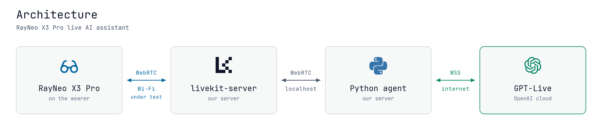
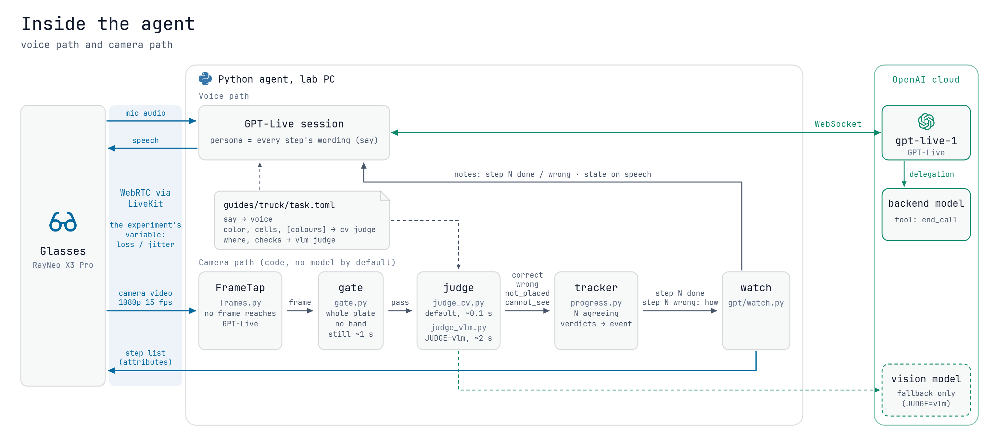

# RayNeo X3 Pro live AI assistant

A voice assistant for RayNeo X3 Pro AR glasses that guides the wearer through a LEGO build,
built on LiveKit and OpenAI's GPT-Live. GPT-Live talks; the agent's own code watches the
camera and decides when a step is done or a brick is wrong. The project is a test bed for
how the network between the glasses and the server changes that experience. A Gemini Live
path is kept but not in use.

## Architecture

<picture>
  <source media="(prefers-color-scheme: dark)" srcset="docs/architecture-dark.png">
  
</picture>

<sub>Sources: `docs/architecture-*.svg`; `python docs/make_diagram.py` regenerates them
and the PNGs (`make_agent_diagram.py` for the figure below).</sub>

The two halves meet in a LiveKit room. The glasses publish microphone and camera tracks
into it; the agent joins the same room, streams the audio to GPT-Live over a WebSocket,
keeps the camera frames for its own code, and publishes GPT-Live's speech back as its own
audio track. The glasses hold no model credentials. The Wi-Fi hop between the glasses and
the server is the experiment's only variable: loss and jitter are injected there.

Three processes in one compose project, host networking (WebRTC needs the server's UDP
ports reachable at the address it advertises):

- **livekit-server** verifies join tokens and forwards media.
- **api**: the glasses `POST /getToken` with a credential; `auth.py` turns it into a user
  id or a 401, `server.py` signs a ten-minute JWT with that identity and a `room_config`
  naming the agent. `AUTH_MODE`: `dev` accepts everyone (private LAN), `static` wants one
  shared bearer token, `jwt` verifies a token from an account system.
- **agent** registers under `AGENT_NAME`, joins only rooms whose token names it, and alone
  holds the model API keys. `AGENT_BACKEND=openai` runs the system below (`agent/src/gpt/`);
  `gemini` runs the old Gemini Live path (`agent/src/gemini/`). Model ids come from `.env`.

### Inside the agent

GPT-Live hears the wearer and speaks; it knows every step's wording but never sees a frame.
The camera goes to the agent's code, which judges the current step and tells the voice what
changed. One task file feeds both.

<picture>
  <source media="(prefers-color-scheme: dark)" srcset="docs/agent-dark.png">
  
</picture>

1. **Voice.** `gpt-live-1` is audio only and full duplex, and owns turn-taking and barge-in
   (no VAD on the session). Its instructions are the persona and every step's `say`
   (`gpt/prompts.py`). Two kinds of text reach it from the camera path (`gpt/watch.py`):
   - a **note** when a step is done or a brick is wrong ("Camera, just now: step 3 is done
     ... give step 4: ..."), sent with `append_instructions`: the voice says it at once,
     cutting into its own sentence if it has to;
   - each time the wearer starts speaking, the **newest camera state**, sent once with
     `append_thinking` ("Camera now: steps 1 to 2 are done; ... the last look showed ..."):
     silent context it answers from. The verdict in it is about a frame 2-3 s old.

   Its one tool, `end_call`, runs through the backend model (`OPENAI_BACKEND_MODEL`).
2. **Gate** (`gate.py`, every frame, ~10 ms): the whole green plate in view and big enough,
   no gross skin over it, not moving, and still for a moment. The thresholds follow the
   judge (`GATE_STILL` / `GATE_MIN_SIDE` / `GATE_MOTION_MAX`): vlm 0.3 s / 0.10 / 30, cv
   1.0 s / 0.23 / 12.
3. **Judge**, about the current step only: correct, wrong, not placed or cannot see, plus one
   sentence.
   - `JUDGE=vlm` (`judge_vlm.py`), the one in use: the plate crop and the step's
     `where`/`checks` to `OPENAI_CHECK_MODEL`, ~2 s a call. Up to `GPT_WATCH_INFLIGHT` (2)
     calls run at once, `GPT_WATCH_GAP` (0.5 s) apart, so a verdict comes about every second.
   - `JUDGE=cv` (`judge_cv.py`), the code default, ~0.1 s and no model: plate corners,
     homography to the stud grid, colour per cell against the layout. Its colour centres
     drift with the call stream's auto exposure, so it does not hold up on the glasses yet.
4. **State machine** (`progress.py`): `GPT_WATCH_CONFIRM` (2) correct in a row and the step is
   done; `GPT_WATCH_WRONG_CONFIRM` (2) wrong among the last three and the brick is wrong, said
   once, and again only after three "not placed" in a row. It never goes back on its own. A
   verdict about a step that has moved on is dropped. A done step moves the build and is published to the glasses as participant
   attributes.
5. **Task file** (`guides/truck/task.toml`): per step the wording the wearer hears, the
   brick's colour and cells (cv), the facts to check (vlm), and the colour tables. `eval/`
   imports the same gate, judge and state machine and replays a recorded run through them
   (`eval/RESULTS.md`).

## Layout

```
backend/
  docker-compose.yml    livekit-server + api + agent, host networking
  .env.example          copy to .env and fill in; one file for all three
  api/src/server.py     POST /getToken, LiveKit's standard token endpoint
  api/src/auth.py       AUTH_MODE = dev | static | jwt
  agent/src/agent.py    entrypoint: AGENT_BACKEND=gemini|openai picks the implementation
  agent/src/guide.py    build guide loader and the state of one run (shared)
  agent/src/frames.py   FrameTap: keeps camera frames for the code
  agent/src/gate.py     which frames are worth judging
  agent/src/judge_vlm.py the judge in use: one step's question to a vision model
  agent/src/judge_cv.py  the CV judge: plate -> grid -> colour per cell, no model
  agent/src/progress.py the state machine: verdicts -> step done / brick wrong
  agent/src/gpt/        agent, config, prompts (persona with every step), watch (camera -> GPT-Live), tools (end_call)
  agent/src/gemini/     the Gemini Live path (not in use)
  agent/src/render.py   reference-model video stream (used by guides with a model.glb; the truck has none)
  agent/guides/         build guides, chosen with BUILD_GUIDE; guides/truck is the current task
android/                Kotlin + Compose app for the glasses
deploy/
  setup.sh              first-time setup on a Linux host: key pair, livekit.yaml, .env
  livekit.lab.yaml      livekit-server config for a private LAN
  glasses.ps1           launch/stop the app on the glasses over adb
  watch.py              coloured live view of the agent log
  record.ps1            record a build with the glasses' stock camera app over adb
eval/                   offline judge / gate / replay evaluation on recorded runs
```

## Running the backend

On a Linux host with Docker:

```shell
deploy/setup.sh lab                 # once: key pair, livekit.yaml and backend/.env
cd backend
docker compose up -d --build        # livekit-server :7880, api on API_PORT, agent
docker compose logs -f --no-log-prefix agent | python3 ../deploy/watch.py   # coloured conversation
docker compose down
```

`setup.sh` fills in the LiveKit keys; put `OPENAI_API_KEY` and the model ids into
`backend/.env` (see `.env.example`). `LIVEKIT_URL` stays on loopback for the agent;
`LIVEKIT_PUBLIC_URL` (`ws://<lan-ip>:7880`) is what `/getToken` hands the glasses. It prints
the ufw rules the glasses need if ufw is active.

What the agent log shows: `experiment:` (every switch of the run), `step n/m start|done`,
`user:` / `assistant:` (both transcripts), `judge:` (each verdict with its latency and
tokens), `gate:` (changes of the gate's reason), `watch: thinking:` / `watch: commentary:`
(what reached the voice), `voice:` (note to speech), `delegation:` (what the voice handed to
the backend model), and `latency:`, the `reply_ms` the glasses measure from the wearer's
last word to the agent's audio (`ReplyLatency.kt`), the number the experiment is about.
`FRAME_DUMP_DIR=/app/frames` keeps every judged frame under `backend/frames/<call>/`, named
by step and verdict (`FRAME_DUMP_MAX` caps the count); the container writes as root, so
delete them with `docker run --rm -v "$PWD/frames:/f" backend-agent sh -c "rm -rf /f/2026*"`.

Without Docker, against `docker run --rm -it --network host livekit/livekit-server --dev`:

```shell
cd backend/api;   uv sync; uv run src/server.py
cd backend/agent; uv sync; uv run src/agent.py start
```

**Never set the root logger to `DEBUG`.** That enables the `websockets` client logger, which
prints outgoing headers including API keys. `--log-level debug` on the agent CLI is scoped
to LiveKit's loggers and is fine. If it happens, rotate the key.

## The glasses

```powershell
cd android
./gradlew :app:assembleDebug        # needs a JDK; Android Studio's jbr works
adb install -r app/build/outputs/apk/debug/app-debug.apk
.\deploy\glasses.ps1 -Ip 192.168.50.147   # launch, pointed at that backend (-Install builds first, -Stop kills it)
```

The debug variant is required: it carries the network security config that allows
cleartext `http://` and `ws://` to a LAN IP. The app stores the token endpoint and
credential; `glasses.ps1` passes them as intent extras, and the connect screen has the same
two fields. On the temple touchpad a tap starts the call and a double tap ends it.

During a call the top line shows who has the floor. Below it the left half lists the
build's steps with the current one highlighted and kept in view (`BuildSteps.kt`); the right
half shows the conversation, newest at the bottom, the wearer's lines in green
(`Captions.kt`). Both halves scroll by themselves. The wearer's lines are the model's
transcript of what it heard, so a word the network dropped is missing there too. The mic is
switched on once the agent reports that it is listening ("Ready"). The call screen leaves by
itself when the room ends.

USB carries adb, not media: `adb reverse` forwards TCP only and libwebrtc binds to the
Wi-Fi interface, so the glasses and the server must share an IP network.

### Two screens

The X3 Pro has a 640x480 panel per eye. Android reports one 1280x480 display at density
160; the left 640 px go to the left eye, the right 640 px to the right. A phone layout is
cut in half, so every screen draws its content twice through `ui/Eyes.kt`. Rules:

- State lives above `Eyes`; a `remember` inside the content runs once per eye and drifts.
- `Eyes` keeps a 24 dp black margin; the optics distort at the panel edges. Do not use
  window insets at the root, they span all 1280 px and break the mirror symmetry.
- The display is additive: black emits nothing, so the background is black and there is no
  light theme.
- Check layouts with `adb shell uiautomator dump`, not `screencap`; the capture is
  post-correction and misreports positions.

### Camera

The sensor is mounted sideways, so frames reach the agent as 1080x1920 portrait. Focus is
fixed. The app publishes one layer at 1920x1080, 15 fps, H264 on the hardware encoder,
4 Mbps (`VoiceAssistantViewModel.kt`), through libwebrtc's `HardwareVideoEncoderFactory`
directly: the SDK's simulcast wrapper crop-scales every frame of this sensor. VP8 is software
on this SoC and stays blurry. `VideoStatsLog.kt` logs encoder resolution, fps and bitrate
every 5 s under `rayneo-video`.

## The Gemini path (not in use)

`AGENT_BACKEND=gemini` runs one Gemini Live model (`GEMINI_MODEL`) that hears, sees the
camera and judges the bricks itself through tools (`get_step`, `look`, `step_done`, ...), with
camera frames sent only while the wearer speaks or the model calls `look` (`sampler.py`).
It is kept as it was; the knobs are in `.env.example` and `agent/src/gemini/`.
`agent/src/inspect_frame.py` re-asks a saved frame at higher media resolutions.

## The lab PC

Ubuntu on the glasses' network, reached over ssh. It runs the recipe above:
`docker compose up -d --build` while testing, `docker compose down` after. The machine has
other jobs, so nothing is installed as a service. `AGENT_MP_CONTEXT=spawn` in `.env` is only
for a host whose CPU lacks AVX2; see the note in `agent.py`.

## When it breaks

A bad API key ends the session at once and the wearer hears silence. The banner turns red:
"Agent left" if an agent was in the room and went, "No agent" if none arrived within 20 s;
both say to double tap out. A connection the SDK is still retrying shows "Reconnecting"; that
banner reads the SDK engine's own state (`EngineState.kt`), because the public room state
stays "connected" through a soft reconnect, which is what a Wi-Fi drop triggers first.

The glasses switch Wi-Fi off by themselves a minute after they decide they have been taken
off (the system's deep-suspend policy; the wear sensor also misfires mid-session).
`glasses.ps1` turns that policy off at launch (`deep_suspend_disabled_persist 1`, survives
reboots); `glasses.ps1 -RestoreSleep` puts it back. If the banner sticks at "Reconnecting",
check `adb shell settings get global wifi_on`; `adb shell svc wifi enable` brings it back.

## Reference

- [GPT-Live plugin](https://docs.livekit.io/agents/models/realtime/plugins/gpt-live/)
- [GPT-Live guide](https://developers.openai.com/api/docs/guides/live)
- [Agent dispatch](https://docs.livekit.io/agents/server/agent-dispatch/)
- [Token endpoint spec](https://docs.livekit.io/frontends/build/authentication/endpoint/)
- [Running LiveKit locally](https://docs.livekit.io/transport/self-hosting/local/)
- [RayNeo dev docs](https://rayneo-en.gitbook.io/rayneo-devdoc/x-series/android-sdk)
- [agent-starter-android](https://github.com/livekit-examples/agent-starter-android), the
  app's origin (MIT, `android/LICENSE`)
- [Earlier prototype](https://github.com/Lambozhuang/rayneo-x3-pro-gemini-live), glasses
  straight to Gemini Live without LiveKit
